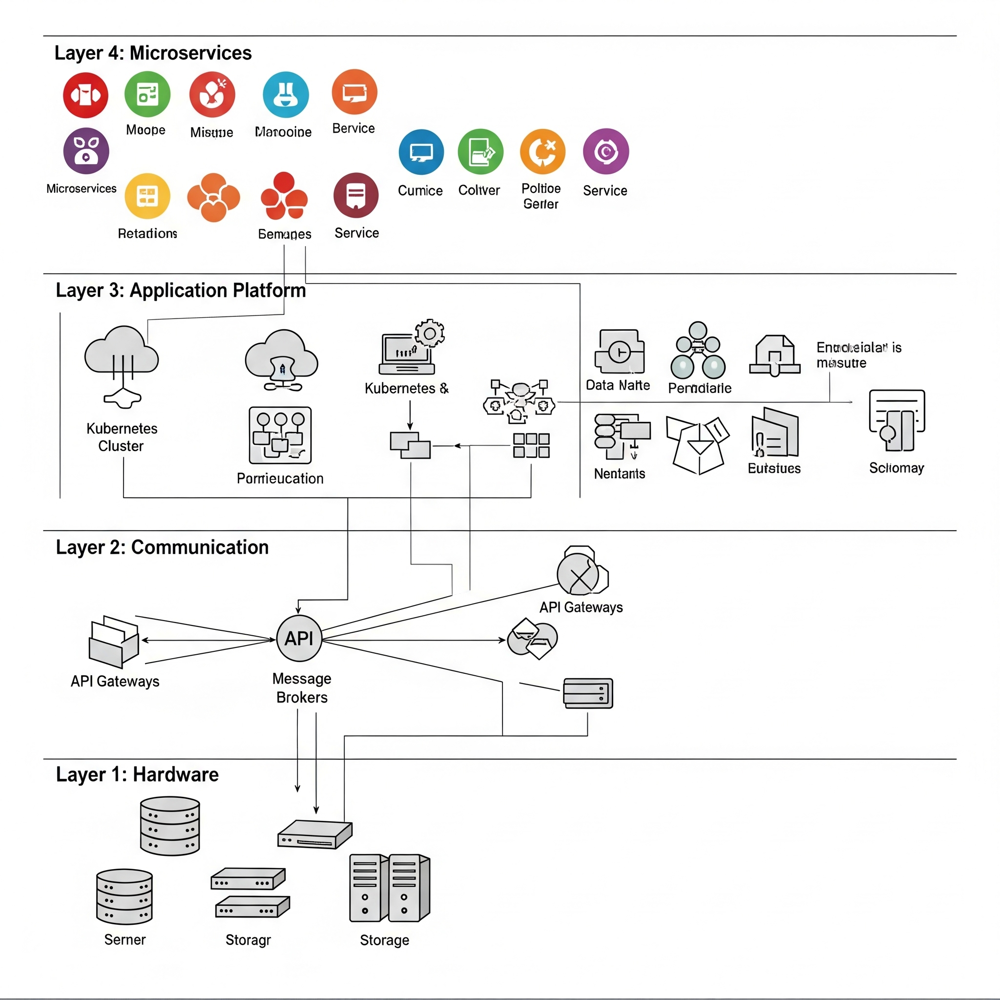

# Microservices
Microservices Learning

# Resumo das Camadas do Ecossistema de Microsserviços

## Camada 1: A Camada de Hardware

### Português
A camada de hardware (camada 1) do ecossistema de microsserviços contém:
* os servidores físicos (de propriedade da empresa ou alugados de provedores de serviços de nuvem)
* databases (dedicados e/ou compartilhados)
* o sistema operacional
* isolamento e abstração de recursos
* gerenciamento de configuração
* monitoramento em nível de servidor
* logging em nível de servidor

### English
The hardware layer (layer 1) of the microservices ecosystem contains:
* physical servers (company-owned or rented from cloud service providers)
* databases (dedicated and/or shared)
* the operating system
* resource isolation and abstraction
* configuration management
* server-level monitoring
* server-level logging

## Camada 2: A Camada de Comunicação

### Português
A camada de comunicação (camada 2) do ecossistema de microsserviços contém:
* rede
* DNS
* Remote Procedure Calls (RPCs)
* endpoints
* troca de mensagens
* descoberta de serviço
* registro de serviço
* balanceamento de carga

### English
The communication layer (layer 2) of the microservices ecosystem contains:
* network
* DNS
* Remote Procedure Calls (RPCs)
* endpoints
* message exchange
* service discovery
* service registration
* load balancing

## Camada 3: A Camada da Plataforma de Aplicação

### Português
A camada da plataforma de aplicação (camada 3) do ecossistema de microsserviços contém:
* ferramentas internas de desenvolvimento do tipo autosserviço
* ambiente de desenvolvimento
* ferramentas de teste, empacotamento, build e liberação
* pipeline de deployment
* logging em nível de microsserviço
* monitoramento em nível de microsserviço

### English
The application platform layer (layer 3) of the microservices ecosystem contains:
* internal self-service development tools
* development environment
* testing, packaging, build, and release tools
* deployment pipeline
* microservice-level logging
* microservice-level monitoring

## Camada 4: A Camada dos Microsserviços

### Português
A camada dos microsserviços (camada 4) do ecossistema de microsserviços contém:
* os microsserviços
* todas as configurações específicas dos microsserviços

### English
The microservices layer (layer 4) of the microservices ecosystem contains:
* the microservices
* all microservice-specific configurations
